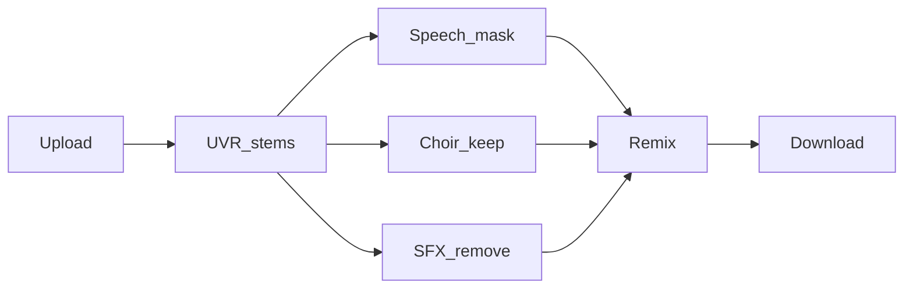
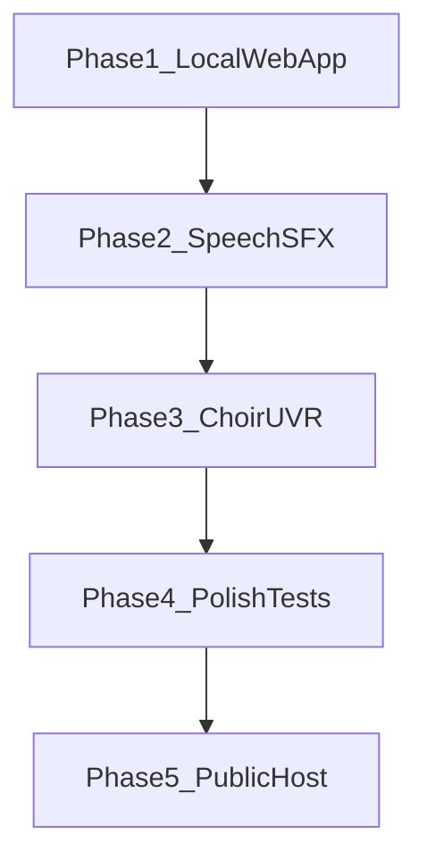

# Music Cleaner

Clean up audio in your browser — remove talking, sound effects, and lead vocals, while trying to keep choir singing.

Runs locally on your PC via **WSL + Docker**. Free. Unlimited. No account needed.

---

## What it does

| Removed (goal) | Kept (goal) |
|----------------|-------------|
| Lead vocals | Instrumental backing |
| Spoken dialogue *(Phase 2)* | Choir / group vocals *(Phase 3)* |
| Sound effects *(Phase 2)* | Musical content |

**Choir caveat:** Perfect choir preservation is hard. Phase 1 only removes vocals using a standard UVR instrumental model — choir may be reduced too. Phase 3 adds dedicated choir logic.

---

## Quick start (WSL)

**Prerequisites**

- WSL 2 with Ubuntu
- [Docker Desktop](https://www.docker.com/products/docker-desktop/) with WSL integration enabled
- 8 GB+ RAM recommended
- Optional: NVIDIA GPU (e.g. RTX 3050 Ti) + [NVIDIA Container Toolkit](https://docs.nvidia.com/datacenter/cloud-native/container-toolkit/install-guide.html) for faster separation

```bash
# In WSL (Ubuntu)
cd ~/projects/music-cleaner
docker compose up --build

# Open in your browser (Windows or WSL)
# http://localhost:5173
```

**First run note:** The backend downloads UVR model weights on first use (hundreds of MB). Allow extra time.

---

## How it works

Phase 1 implements **step 1 only**: upload → UVR stem separation → download instrumental.



Later phases fill in speech detection, SFX removal, choir preservation, and remix.

---

## Tech stack

Everything this project uses, from browser to ML models.

### Environment and packaging

| Tool | Version / notes | Purpose | Phase |
|------|-----------------|---------|-------|
| **WSL 2** | Ubuntu recommended | Run Linux toolchain on Windows | 1 |
| **Docker Desktop** | WSL 2 backend enabled | Package app + dependencies | 1 |
| **Docker Compose** | v2 | Start frontend + backend together | 1 |
| **NVIDIA Container Toolkit** | Optional | GPU acceleration in Docker | 1 |

### Frontend

| Tool | Purpose | Phase |
|------|---------|-------|
| **React** 18 | UI components (upload, progress, download) | 1 |
| **TypeScript** | Typed JavaScript | 1 |
| **Vite** 5 | Dev server, HMR, production build | 1 |
| **@vitejs/plugin-react** | React support in Vite | 1 |
| **CSS** (plain) | Styling | 1 |
| **Vitest** | Unit tests (Jest-compatible) | 4 |
| **React Testing Library** | Component tests | 4 |
| **jsdom** | DOM environment for Vitest | 4 |

### Backend and API

| Tool | Purpose | Phase |
|------|---------|-------|
| **Python** 3.11 | Backend language | 1 |
| **FastAPI** | REST API (`/upload`, `/jobs`, `/models`) | 1 |
| **Uvicorn** | ASGI server | 1 |
| **Pydantic** v2 | Request/response schemas | 1 |
| **pydantic-settings** | Config from env vars | 1 |
| **python-multipart** | File upload handling | 1 |
| **FastAPI BackgroundTasks** | Async job processing (in-process queue) | 1 |
| **pytest** | Backend unit tests | 4 |
| **pytest-asyncio** | Async test support | 4 |
| **httpx** | FastAPI TestClient / API tests | 4 |
| **pytest-mock** | Mock ML pipeline in tests | 4 |

### ML, audio separation, and signal processing

| Tool | Purpose | Phase |
|------|---------|-------|
| **PyTorch** | Deep learning runtime for all models | 1 |
| **audio-separator** | Python wrapper for UVR models | 1 |
| **Ultimate Vocal Remover (UVR)** models | Vocal/instrumental stem separation | 1 |
| — VR Arch (`.pth`) | Fast 2-stem separation | 1 / 3 |
| — MDX-Net (`.onnx`) | Reliable 2-stem, karaoke series | 1 / 3 |
| — MDXC / Roformer (`.ckpt`) | Highest-quality separation | 1 / 3 |
| — Demucs (`.yaml`) | 4-stem / 6-stem decomposition | 3 |
| **Demucs** | Multi-stem separation (via audio-separator) | 3 |
| **OmniVAD** | Speech vs singing vs music detection | 2 |
| **PANNs** (`panns-inference`) | Sound effect detection (AudioSet) | 2 |
| **librosa** | Audio analysis (chroma, spectral features) | 2 / 3 |
| **soundfile** | Read/write WAV | 1 |
| **NumPy** | Array math | 1 |
| **SciPy** | Signal processing (crossfade, filters) | 4 |
| **ffmpeg** | Format conversion, optional MP3 export | 1 / 4 |

### Data storage and job management

| Tool | Purpose | Phase |
|------|---------|-------|
| **Local filesystem** | Uploaded audio, stems, output files | 1 |
| **`status.json` per job** | Job progress (no database) | 1 |
| **Docker volumes** | Persist models + jobs across restarts | 1 |

**Not used (by design):** Redis, Celery, PostgreSQL, SQLite, S3, accounts/auth.

### Public hosting (deferred)

| Tool | Purpose | Phase |
|------|---------|-------|
| **Caddy** | Reverse proxy + automatic HTTPS | 5 |
| **Let's Encrypt** | Free TLS certificates (via Caddy) | 5 |
| **docker-compose.prod.yml** | Production overrides | 5 |

> **React + Vite + TypeScript** frontend → **FastAPI + PyTorch + audio-separator (UVR)** backend → **filesystem job store**, packaged with **Docker Compose on WSL**.

### What you might recognize from coursework

| Layer | Typical courses |
|-------|-----------------|
| React + TypeScript + Vite | Web Development, Software Engineering |
| FastAPI + REST | Backend Development, Distributed Systems (intro) |
| Background jobs + filesystem store | Operating Systems, Databases (without SQL) |
| PyTorch + UVR models | Machine Learning, Deep Learning electives |
| librosa / signal processing | Digital Signal Processing (if offered) |
| Docker + Compose | DevOps / Software Deployment workshops |

---

## Implementation roadmap

Phases are sequential — each builds on the previous. Phase 5 is optional.



### Phase 1 — Local web app + basic vocal removal `[in progress]`

**Goal:** Run the app in your browser at `localhost`, upload a song, download an instrumental (vocals removed) using a UVR preset.

**Done when:** `docker compose up` works in WSL; upload → progress → download completes for a short WAV/MP3.

| # | Task | Status | Files |
|---|------|--------|-------|
| 1.1 | Create project folder + `.gitignore` | [x] | repo root |
| 1.2 | Write README with this roadmap | [x] | `README.md` |
| 1.3 | Add FastAPI app skeleton + health route | [x] | `backend/app/main.py` |
| 1.4 | Add settings (jobs dir, models dir, CORS) | [x] | `backend/app/settings.py` |
| 1.5 | Add filesystem job store (`status.json`) | [x] | `backend/app/job_store.py` |
| 1.6 | Add 3 UVR presets (Fast / Balanced / High Quality) | [x] | `backend/app/pipeline/model_registry.py` |
| 1.7 | Wrap `audio-separator` for instrumental output | [x] | `backend/app/pipeline/separator.py` |
| 1.8 | Add `POST /api/upload` (save file, queue job) | [x] | `backend/app/main.py` |
| 1.9 | Add background task to run separation | [x] | `backend/app/main.py` |
| 1.10 | Add `GET /api/jobs/{id}` progress endpoint | [x] | `backend/app/main.py` |
| 1.11 | Add `GET /api/jobs/{id}/download` | [x] | `backend/app/main.py` |
| 1.12 | Add `GET /api/models` preset list | [x] | `backend/app/main.py` |
| 1.13 | Add backend `Dockerfile` + `requirements.txt` | [x] | `backend/` |
| 1.14 | Scaffold React + Vite + TypeScript frontend | [x] | `frontend/` |
| 1.15 | Build upload form + model dropdown | [x] | `frontend/src/App.tsx` |
| 1.16 | Add API client + job polling | [x] | `frontend/src/api/client.ts` |
| 1.17 | Add download link when job completes | [x] | `frontend/src/App.tsx` |
| 1.18 | Wire `docker-compose.yml` (frontend + backend + volumes) | [x] | repo root |
| 1.19 | Smoke test: upload 30s clip, download instrumental | [ ] | manual |
| 1.20 | `git init` + first commit | [ ] | repo root |

---

### Phase 2 — Speech + SFX removal `[not started]`

**Goal:** Remove spoken dialogue and non-musical sound effects from the mix, not just lead vocals.

**Done when:** A track with talking over music has speech muted; obvious SFX (explosion, footsteps) are reduced.

| # | Task | Files |
|---|------|-------|
| 2.1 | Add `omnivad` to backend dependencies | `backend/requirements.txt` |
| 2.2 | Create speech detection module (timestamp segments) | `backend/app/pipeline/speech.py` |
| 2.3 | Mute/attenuate speech regions in audio | `backend/app/pipeline/speech.py` |
| 2.4 | Add `panns-inference` dependency | `backend/requirements.txt` |
| 2.5 | Create SFX detection module (AudioSet denylist) | `backend/app/pipeline/sfx.py` |
| 2.6 | Attenuate SFX frames, keep musical classes | `backend/app/pipeline/sfx.py` |
| 2.7 | Chain speech + SFX steps in job pipeline | `backend/app/main.py` |
| 2.8 | Report sub-stages in `status.json` | `backend/app/job_store.py` |
| 2.9 | Add speech strength slider to UI (0–100%) | `frontend/src/App.tsx` |
| 2.10 | Add SFX strength slider to UI | `frontend/src/App.tsx` |
| 2.11 | Update progress bar labels per stage | `frontend/src/App.tsx` |
| 2.12 | Test with dialogue-over-music sample | manual |

---

### Phase 3 — Choir preservation + UVR model options `[not started]`

**Goal:** Remove all vocals except choir; let users pick from more UVR models.

**Done when:** Karaoke mode subtracts lead vocal and re-adds choir candidate; UI shows multiple UVR presets + karaoke sub-options.

| # | Task | Files |
|---|------|-------|
| 3.1 | Add Karaoke UVR presets to registry | `model_registry.py` |
| 3.2 | Add UVR Classic + ensemble presets | `model_registry.py` |
| 3.3 | Add `GET /api/models?full=true` | `backend/app/main.py` |
| 3.4 | Create choir extraction module (lead subtract) | `backend/app/pipeline/choir.py` |
| 3.5 | Add stereo-width + polyphony heuristics | `backend/app/pipeline/choir.py` |
| 3.6 | Create remix module (stems → final wav) | `backend/app/pipeline/remix.py` |
| 3.7 | Wire choir pipeline branch when karaoke preset selected | `backend/app/main.py` |
| 3.8 | Add karaoke sub-model dropdown in UI | `frontend/src/App.tsx` |
| 3.9 | Add choir aggressiveness slider | `frontend/src/App.tsx` |
| 3.10 | Add vocal bleed reduction slider | `frontend/src/App.tsx` |
| 3.11 | Optional: browse-all-models table | `frontend/src/` |
| 3.12 | Optional: per-arch UVR tuning | frontend + API |
| 3.13 | Test pop song with choir section | manual |

---

### Phase 4 — Polish + tests `[not started]`

**Goal:** Production-quality output and automated tests so refactors are safe.

**Done when:** pytest + Vitest pass; output has crossfades + normalization; README has troubleshooting.

| # | Task | Files |
|---|------|-------|
| 4.1 | Add crossfade at segment boundaries | `remix.py` |
| 4.2 | Normalize output peak (-1 dBFS) | `remix.py` |
| 4.3 | Optional MP3 export via ffmpeg | `remix.py` |
| 4.4 | Validate file type + size on upload | `backend/app/main.py` |
| 4.5 | Auto-delete jobs older than 24h | `backend/app/job_store.py` |
| 4.6 | Set up pytest + test API routes (mock ML) | `backend/tests/` |
| 4.7 | Set up Vitest + test API client + App | `frontend/src/` |
| 4.8 | Add hardware requirements table to README | `README.md` |
| 4.9 | Add troubleshooting section | `README.md` |
| 4.10 | Manual smoke test checklist | `README.md` |

---

### Phase 5 — Public website hosting (deferred) `[not started]`

**Goal:** Optional — deploy so others can visit a URL (you pay for server hosting).

**Done when:** `docker compose -f docker-compose.prod.yml up` serves HTTPS on a domain.

| # | Task | Files |
|---|------|-------|
| 5.1 | Add `docker-compose.prod.yml` | repo root |
| 5.2 | Add Caddy reverse proxy + auto HTTPS | `deploy/Caddyfile` |
| 5.3 | Write VPS deploy guide | `deploy/README.md` |
| 5.4 | Add concurrent job limit env var | prod compose |
| 5.5 | Add UI notice: "audio processed on this server" | frontend |

---

## Project structure

```
music-cleaner/
├── docker-compose.yml          # Start frontend + backend together
├── .env.example                # Optional env overrides
├── README.md
├── backend/
│   ├── Dockerfile
│   ├── requirements.txt
│   ├── jobs/                   # Uploaded files + status.json (gitignored)
│   ├── models/                 # Downloaded UVR weights (gitignored)
│   └── app/
│       ├── main.py             # FastAPI routes + background worker
│       ├── settings.py           # Config from environment
│       ├── job_store.py          # Filesystem job persistence
│       └── pipeline/
│           ├── model_registry.py # Fast / Balanced / High Quality presets
│           └── separator.py      # audio-separator wrapper
└── frontend/
    ├── Dockerfile
    ├── vite.config.ts          # Dev server + /api proxy to backend
    └── src/
        ├── App.tsx               # Upload form, progress, download
        ├── api/client.ts         # fetch helpers + TypeScript types
        └── vite-env.d.ts         # Vite type definitions
```

---

## Hardware guide

| Hardware | Good enough? | Recommended model | ~Time per 4-min song |
|----------|-------------|-------------------|----------------------|
| RTX 3050 Ti | Yes | Balanced / High Quality | 30s – 2 min |
| Intel Iris Xe / UHD | Yes (CPU) | Fast | 5–10 min |

---

## API reference (Phase 1)

| Method | Endpoint | Description |
|--------|----------|-------------|
| `GET` | `/api/health` | Health check (`{"status":"ok"}`) |
| `GET` | `/api/models` | List UVR presets |
| `POST` | `/api/upload` | Upload audio (`file`, `model_id`) → `{ job_id }` |
| `GET` | `/api/jobs/{id}` | Job status + progress |
| `GET` | `/api/jobs/{id}/download` | Download instrumental WAV |

---

## Troubleshooting

| Problem | Likely cause | Fix |
|---------|--------------|-----|
| `docker compose` not found | Docker Desktop not running | Start Docker Desktop; enable WSL integration |
| Frontend loads but upload fails | Backend not ready | Wait for backend logs; check `http://localhost:8000/api/health` |
| Very slow first job | Model download + CPU inference | Use **Fast** preset; enable GPU in `docker-compose.yml` |
| Out of memory | Model too large for RAM | Close other apps; use **Fast** preset; shorter clip |
| CORS error in browser | Wrong origin | Ensure you open `http://localhost:5173` (not raw `:8000`) |
| Download 400 | Job still processing | Wait until progress hits 100% |

---

## Credits

Vocal separation uses [Ultimate Vocal Remover](https://github.com/Anjok07/ultimatevocalremovergui) models via [audio-separator](https://github.com/nomadkaraoke/python-audio-separator) (MIT license).
